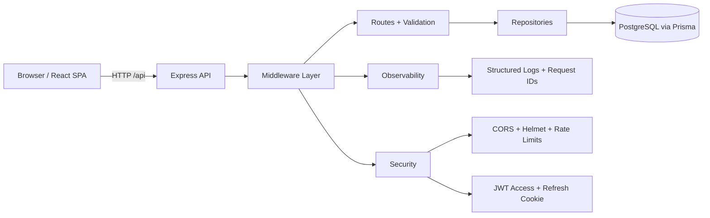

# StyleHub Commerce

Production-style full-stack e-commerce app built with React + Express + PostgreSQL (Prisma), designed as a portfolio-ready project with security hardening, observability, typed validation, CI, Docker, and tests.

## Overview

StyleHub Commerce demonstrates a realistic online storefront with:
- JWT auth + refresh token flow
- RBAC (admin vs user)
- Product catalog, cart, checkout, and persisted orders
- Admin product dashboard with filters, pagination, and CRUD workflows
- Production-focused backend middleware and API design

It solves the common gap between tutorial projects and production expectations by implementing secure defaults, migration-based data modeling, and automated quality gates.

## Feature List

- User registration, login, token verification, profile update
- Refresh token cookie flow
- Product listing with server-side pagination/filtering/sorting
- Product detail and cart interactions
- Checkout that creates persisted orders and order items
- Admin dashboard:
  - Product data table
  - Search + category filters
  - Pagination
  - Create/edit/delete product forms with client validation
- Health endpoint: GET /health
- Structured logging + request correlation IDs
- Rate limiting on auth/write endpoints
- Centralized error handling with consistent JSON shape

## Tech Stack

- Frontend: React 18, React Router, Vite, Tailwind CSS
- Backend: Node.js, Express
- Validation: Zod
- Auth: JWT access token + refresh token cookie
- Database: PostgreSQL
- ORM / Migrations: Prisma
- Logging: Pino + pino-http
- Tests: Vitest, Supertest, Playwright
- CI: GitHub Actions
- Local infra: Docker Compose

## Architecture



## Project Structure

- src/: React app (.jsx)
- routes/: Express route modules
- middleware/: request id, auth, validation, rate limit, errors
- repositories/: data access layer (Prisma-backed)
- prisma/: schema, migrations, seed script
- tests/: unit + api + e2e tests
- .github/workflows/: CI pipeline

## Local Setup

### 1) Install dependencies

```bash
npm install
```

### 2) Configure environment

```bash
cp .env.example .env
```

### 3) Start PostgreSQL in Codespace (no local install needed)

```bash
docker compose up -d postgres
```

### 4) Run migrations + seed

```bash
npx prisma migrate dev --name init
npx prisma generate
npx prisma db seed
```

### 5) Start app

```bash
npm run dev
```

- Frontend: http://localhost:3000
- Backend: http://localhost:5000

## Environment Variables

See .env.example. Core variables:

- NODE_ENV
- PORT
- FRONTEND_ORIGIN
- DATABASE_URL
- JWT_SECRET
- JWT_REFRESH_SECRET
- JWT_EXPIRES_IN
- AUTH_RATE_LIMIT_MAX
- WRITE_RATE_LIMIT_MAX
- LOG_LEVEL
- APP_VERSION

## API Error Format

All handled API errors follow a consistent JSON shape:

```json
{
  "success": false,
  "error": {
    "code": "VALIDATION_ERROR",
    "message": "Request validation failed",
    "details": {}
  },
  "meta": {
    "requestId": "...",
    "timestamp": "2026-03-23T00:00:00.000Z"
  }
}
```

## Running Tests

### Unit + Integration

```bash
npm run test
```

### E2E (Playwright)

```bash
npx playwright install --with-deps
npm run test:e2e
```

## CI (GitHub Actions)

Workflow: .github/workflows/ci.yml

On push/PR, CI runs:
1. npm ci
2. Prisma generate + migrate deploy + seed (against CI Postgres service)
3. lint
4. tests
5. build

Dependency caching is enabled through actions/setup-node npm cache.

## Docker / Local Dev

### Run Postgres only

```bash
docker compose up -d postgres
```

### Run full stack containerized

```bash
docker compose up --build
```

## Deployment Guide (One Path)

### Path: Render + Managed Postgres

1. Provision PostgreSQL (Render/Neon/Supabase).
2. Set env vars in host:
   - DATABASE_URL
   - JWT_SECRET
   - JWT_REFRESH_SECRET
   - FRONTEND_ORIGIN
3. Build command:

```bash
npm ci && npm run prisma:generate && npm run build
```

4. Start command:

```bash
npm run prisma:deploy && npm start
```

5. Point static/assets and API domain, ensure HTTPS and secure cookies in production.

## Engineering Decisions / Tradeoffs

- Chose incremental refactor over rewrite to preserve reviewability.
- Kept backend in .js for Node compatibility and low-risk migration speed; frontend app code is kept in .jsx.
- Implemented JWT + refresh cookie to improve auth resilience without introducing full OAuth complexity.
- Added Prisma for migrations and schema consistency; this replaced mixed persistence and removed in-memory orders.
- Kept ESLint config intentionally lightweight to prioritize CI reliability while enabling future stricter linting.

## Roadmap

- Move backend to TypeScript for stronger API contracts.
- Add order management UI for admins.
- Add password reset and email verification.
- Add OpenAPI spec + SDK generation.
- Add optimistic UI and caching layer (React Query).
- Expand security with refresh token rotation + revocation lists.
- Add load/performance tests and query profiling.

## Demo Accounts (Seeded)

- Admin: admin@stylehub.com / password123
- User: user@stylehub.com / password123
