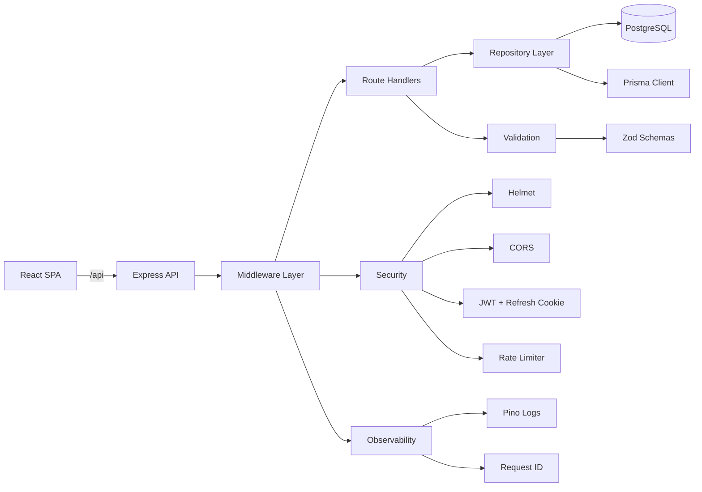
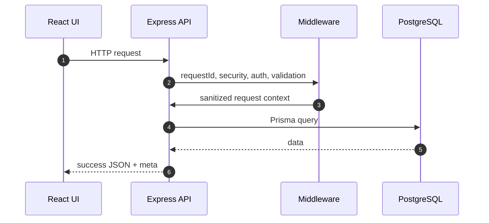
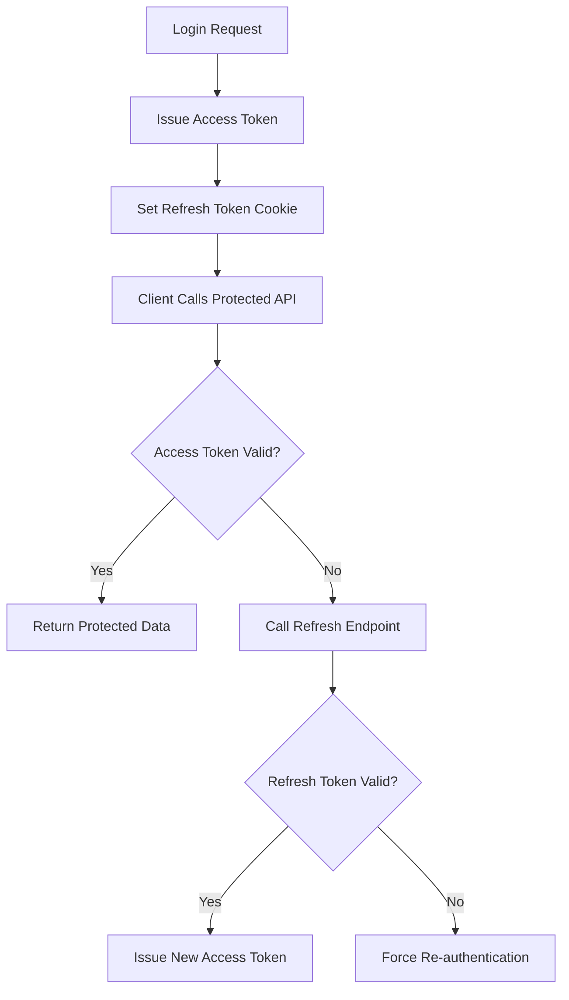

# StyleHub Commerce

<p align="center">
  
</p>

<p align="center">
  
  
  
  
  
</p>

Production-style full-stack e-commerce platform with secure authentication, role-based access control, admin operations, observability, test automation, Docker support, and migration-driven database lifecycle.

## Table of Contents

1. [Product Vision](#product-vision)
2. [Core Capabilities](#core-capabilities)
3. [Admin Control Center](#admin-control-center)
4. [Architecture](#architecture)
5. [Data Model](#data-model)
6. [Tech Stack](#tech-stack)
7. [Project Structure](#project-structure)
8. [Quick Start](#quick-start)
9. [Environment Variables](#environment-variables)
10. [Command Reference](#command-reference)
11. [API Overview](#api-overview)
12. [Authentication Flow](#authentication-flow)
13. [Observability and Security](#observability-and-security)
14. [Testing and Quality Gates](#testing-and-quality-gates)
15. [Docker and Deployment](#docker-and-deployment)
16. [Troubleshooting](#troubleshooting)
17. [Roadmap](#roadmap)
18. [Seeded Demo Accounts](#seeded-demo-accounts)

## Product Vision

StyleHub Commerce is designed to bridge the gap between tutorial-level apps and production expectations. The application demonstrates realistic commerce workflows while keeping the codebase approachable for learning, extension, and portfolio presentation.

Primary goals:
- Build a secure, end-to-end commerce flow (catalog to checkout to order management).
- Apply backend best practices (validation, error contracts, logs, rate limits, RBAC).
- Keep local developer experience smooth with Docker + Prisma migrations + seeded data.
- Maintain confidence through lint, tests, and build verification.

## Core Capabilities

### Customer-facing
- Register, log in, verify session, and manage profile.
- Browse products with search, category filtering, sorting, and pagination.
- View product details.
- Add items to cart and manage quantities.
- Checkout and create persisted orders with order items.

### Platform-level
- JWT access token with refresh token cookie flow.
- Role-based route protection (`admin` and `user`).
- Consistent API response and error shape.
- Structured request logging with correlation IDs.
- Write/auth rate limiting.
- Prisma migrations and seed lifecycle.

## Admin Control Center

The admin panel is now organized as a multi-tab operational console:

1. Overview
- KPI cards for revenue, orders, customer count, product count, and low-stock count.
- Top-selling products snapshot.
- Low-stock alerts list.

2. Products
- Search and category filtering.
- Pagination.
- Create, update, delete product workflows.
- Image URL and file upload support.
- Bulk actions:
  - Adjust stock in batch.
  - Set category in batch.
  - Delete in batch.

3. Orders
- Paginated order list.
- Filter by status.
- Update order status from admin UI.

4. Categories
- Create, update, and delete categories.
- Product count per category.

5. Audit
- Paginated activity logs.
- Filter logs by entity type.
- Includes admin actions for products, categories, and order status changes.

## Architecture



### Request lifecycle



## Data Model

Main Prisma models:
- User
- Category
- Product
- CartItem
- Order
- OrderItem
- RefreshToken
- AuditLog

Important enums:
- `UserRole`: `user`, `admin`
- `OrderStatus`: `pending`, `processing`, `shipped`, `delivered`, `cancelled`

Relational highlights:
- A user has many orders, cart items, refresh tokens, and audit logs.
- A category has many products.
- An order has many order items.
- Audit logs may belong to a user (`SetNull` on delete).

## Tech Stack

### Frontend
- React 18
- React Router
- Vite
- Tailwind CSS

### Backend
- Node.js
- Express
- Zod validation
- JWT auth + cookie refresh strategy
- Multer (admin image uploads)

### Data and infra
- PostgreSQL
- Prisma ORM + migrations + seed
- Docker / Docker Compose

### Quality and CI
- ESLint
- Vitest
- Supertest
- Playwright
- GitHub Actions CI

## Project Structure

```text
src/                  React app (.jsx)
  components/         shared UI + route guards
  contexts/           auth/cart/product state management
  pages/              route screens including admin control center

routes/               Express route modules
repositories/         Prisma data access functions
middleware/           auth, validation, requestId, error handling, rate limits
validators/           Zod schemas for route payloads
lib/                  env/logger/prisma bootstrap
prisma/               schema, migrations, seed script
tests/                unit, API integration, E2E
uploads/              product images uploaded by admin
```

## Quick Start

### 1) Install dependencies

```bash
npm install
```

### 2) Configure environment

```bash
cp .env.example .env
```

### 3) Start PostgreSQL

```bash
docker compose up -d postgres
```

### 4) Initialize schema and seed data

```bash
npx prisma migrate dev --name init
npx prisma generate
npx prisma db seed
```

### 5) Start app in development

```bash
npm run dev
```

Default local endpoints:
- Frontend: http://localhost:3000
- Backend: http://localhost:5000

## Environment Variables

Configured from `.env` (template in `.env.example`):

| Variable | Purpose | Example |
|---|---|---|
| `NODE_ENV` | Runtime mode | `development` |
| `PORT` | API server port | `5000` |
| `APP_VERSION` | App metadata in health/log contexts | `1.1.0` |
| `FRONTEND_ORIGIN` | Allowed CORS origin | `http://localhost:3000` |
| `DATABASE_URL` | PostgreSQL connection string | `postgresql://...` |
| `JWT_SECRET` | Access token signing secret | `replace-with-strong-access-secret` |
| `JWT_REFRESH_SECRET` | Refresh token signing secret | `replace-with-strong-refresh-secret` |
| `JWT_EXPIRES_IN` | Access token duration | `15m` |
| `AUTH_RATE_LIMIT_MAX` | Auth route request cap | `30` |
| `WRITE_RATE_LIMIT_MAX` | Write route request cap | `120` |
| `LOG_LEVEL` | Pino log verbosity | `info` |
| `SEED_ADMIN_EMAIL` | Seed admin account email | `admin@stylehub.com` |
| `SEED_ADMIN_PASSWORD` | Seed admin account password | `password123` |

## Command Reference

| Command | Description |
|---|---|
| `npm run dev` | Run API and frontend concurrently |
| `npm run server` | Run backend with nodemon |
| `npm run client` | Run Vite frontend |
| `npm run lint` | Lint JS/JSX files |
| `npm run test` | Run unit + API tests |
| `npm run test:watch` | Run tests in watch mode |
| `npm run test:e2e` | Run Playwright E2E suite |
| `npm run build` | Build frontend for production |
| `npm run preview` | Preview production build |
| `npm run prisma:generate` | Generate Prisma client |
| `npm run prisma:migrate` | Run Prisma dev migration |
| `npm run prisma:deploy` | Apply production migrations |
| `npm run prisma:seed` | Seed database |
| `npm start` | Start backend in production mode |

## API Overview

### Public and auth
- `GET /health`
- `POST /api/auth/register`
- `POST /api/auth/login`
- `POST /api/auth/refresh`
- `POST /api/auth/logout`
- `GET /api/auth/verify`

### Products and categories
- `GET /api/products`
- `GET /api/products/:id`
- `POST /api/products` (admin)
- `PUT /api/products/:id` (admin)
- `DELETE /api/products/:id` (admin)
- `POST /api/products/:id/image` (admin)
- `POST /api/products/bulk` (admin)
- `GET /api/categories`
- `GET /api/categories/:id`
- `POST /api/categories` (admin)
- `PUT /api/categories/:id` (admin)
- `DELETE /api/categories/:id` (admin)

### Orders and users
- `POST /api/orders`
- `GET /api/orders/my-orders`
- `GET /api/orders/:id`
- `GET /api/orders` (admin)
- `PUT /api/orders/:id/status` (admin)
- `GET /api/users/profile`
- `PUT /api/users/profile`
- `GET /api/users` (admin)
- `GET /api/users/:id` (admin)

### Admin analytics and audit
- `GET /api/admin/dashboard/summary`
- `GET /api/admin/inventory/low-stock`
- `GET /api/admin/audit-logs`

### Standard error contract

```json
{
  "success": false,
  "error": {
    "code": "VALIDATION_ERROR",
    "message": "Request validation failed",
    "details": {}
  },
  "meta": {
    "requestId": "f7cb02be-8f83-4a30-8ff3-c6fdf45ec8d5",
    "timestamp": "2026-03-23T00:00:00.000Z"
  }
}
```

## Authentication Flow



## Observability and Security

### Security controls
- Helmet hardening for HTTP headers.
- CORS origin restriction via environment config.
- JWT auth middleware for protected routes.
- Role-based admin authorization middleware.
- Route-level request throttling for auth and writes.
- Strict request validation with Zod.

### Observability controls
- Pino JSON logging.
- Request correlation ID middleware.
- Centralized error mapper with stable error envelope.
- Health endpoint for uptime checks.

## Testing and Quality Gates

### Local quality checks

```bash
npm run lint
npm run test
npm run build
```

### E2E setup

```bash
npx playwright install --with-deps
npm run test:e2e
```

### CI pipeline

Workflow in `.github/workflows/ci.yml` runs:
1. Install dependencies (`npm ci`)
2. Prisma client generation and migrations
3. Seed test data
4. Lint
5. Tests
6. Production build

## Docker and Deployment

### Local PostgreSQL only

```bash
docker compose up -d postgres
```

### Full stack via Docker

```bash
docker compose up --build
```

### Generic deployment runbook

1. Provision managed PostgreSQL.
2. Configure production environment variables.
3. Build:

```bash
npm ci && npm run prisma:generate && npm run build
```

4. Start:

```bash
npm run prisma:deploy && npm start
```

5. Ensure HTTPS, secure cookies, and correct frontend origin.

## Troubleshooting

### Prisma connection or migration failures
- Verify Docker Postgres is running.
- Confirm `DATABASE_URL` points to reachable host/port/database.
- Re-run `npx prisma generate` after schema updates.

### E2E failures in fresh environments
- Install browser dependencies with:

```bash
npx playwright install --with-deps
```

### Build warnings about chunk size
- Consider route-level code splitting with dynamic imports.
- Configure manual chunking in Vite if needed.

### Browserslist data warning
- Refresh caniuse database:

```bash
npx update-browserslist-db@latest
```

## Roadmap

- Add dedicated admin customer management UI.
- Add discount and promotion engine.
- Add CSV import/export for products.
- Add OpenAPI schema and client generation.
- Add token rotation and revocation list for refresh sessions.
- Add performance profiling and load testing.

## Seeded Demo Accounts

- Admin: `admin@stylehub.com` / `password123`
- User: `user@stylehub.com` / `password123`

## README Animation Notes

This README includes animated visuals through generated SVG assets (typing header and status badges). If your environment blocks remote image rendering, the project documentation remains fully readable without animation.
